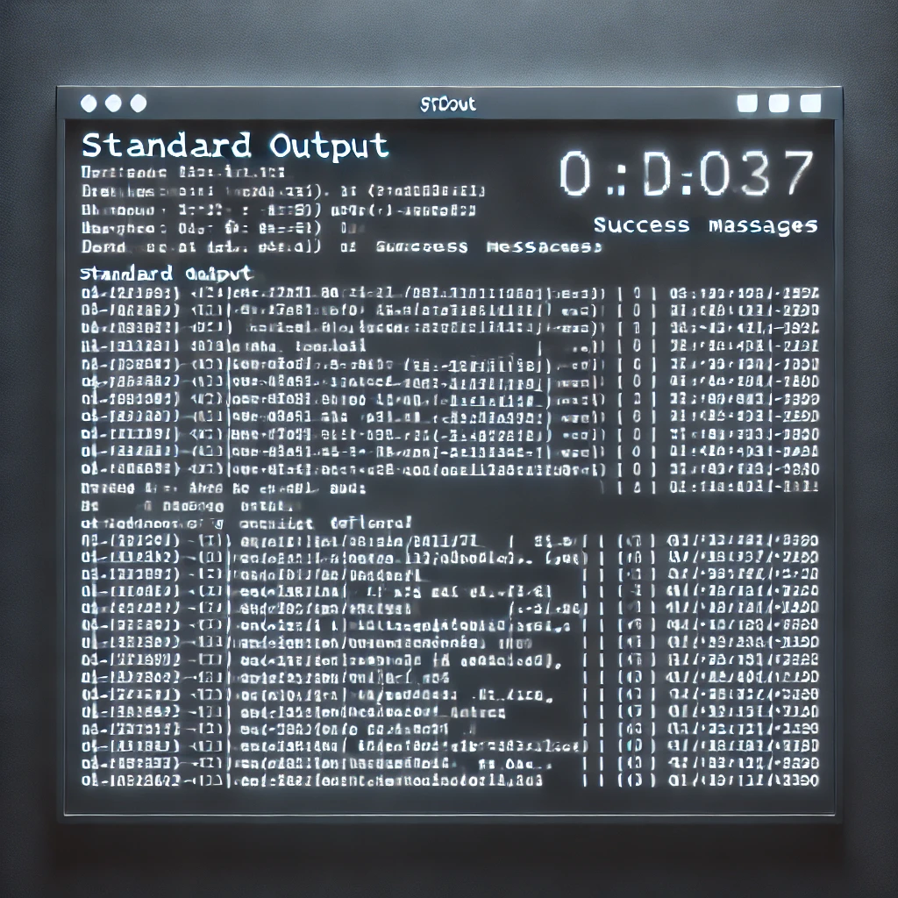

# Std.Out

Captures the output of services to assist with debugging.  
This project is tailored towards AWS, and is not suitable for general purpose diagnostics.  

**Stdout** pulls data from various sources for display:
* **CloudWatch:** Gathers related messages across log streams, and groups.
* **S3:** Download assets files.
* **DynamoDB:** Load items.

  

# Nuget

[Package](https://www.nuget.org/packages/md.stdout)
```console
dotnet add package md.stdout
```

[.NET CLI](https://www.nuget.org/packages/md.stdout.cli)
```console
dotnet tool install --global md.stdout.cli
```

**RUN**
```console
stdout verb [options] [flags]
```

# .NET CLI

**Flags**
```console
stdout verb [options] --nolog

--nolog | -nl: Disable logging to the console.
```

**CloudWatch**
```console
stdout cw --key appname --cid c6b8c804-34cb-4cf7-b762-d24b644831e9

--key | -k: The name of the configuration in app settings, that defines the log groups to query, and general filter rules.
--cid | -c: The Correlation Id to filter the logs by.

stdout cw --key appname --action createCustomer --actionkey appname

--key | -k: The name of the configuration in app settings, that defines the log groups to query, and general filter rules.
--action | -a: The name of the action to load correlation data from.
--actionkey | -ak: The name of the Load source to use from the configuration in app settings.
```

**S3**
```console
stdout s3 --key appname --cid c6b8c804-34cb-4cf7-b762-d24b644831e9

--key | -k: The name of the configuration in app settings, that defines the bucket, and path prefix.
--cid | -c: The Correlation Id is part of (or all) of the key, that target files are found under the prefix, and correlation id.

stdout s3 --key appname --action createCustomer --actionkey appname

--key | -k: The name of the configuration in app settings, that defines the bucket, and path prefix.
--action | -a: The name of the action to load correlation data from.
--actionkey | -ak: The name of the Load source to use from the configuration in app settings.

stdout s3 --key appname --path assets/plaintext/c6b8c804-34cb-4cf7-b762-d24b644831e9

--key | -k: The name of the configuration in app settings, that defines the bucket, and path prefix.
--path | -p: The prefix key path of a S3 bucket, to retrieve files from (i.e. a static path, not merged with a correlation id at runtime).
```

**DynamoDB**
```console
stdout db --key appname --cid c6b8c804-34cb-4cf7-b762-d24b644831e9

--key | -k: The name of the configuration in app settings, that defines the table name, and index to use.
--cid | -c: The Correlation Id stored in a table's index. Used to get the item's pk, and sk values; in order to load the db item.

stdout db --key appname --action createCustomer --actionkey appname

--key | -k: The name of the configuration in app settings, that defines the table name, and index to use.
--action | -a: The name of the action to load correlation data from.
--actionkey | -ak: The name of the Load source to use from the configuration in app settings.

stdout db --key appname --partitionkey pk_value

--key | -k: The name of the configuration in app settings, that defines the table name, and index to use.
--partitionkey | -pk: The Partition Key for an item.

stdout db --key appname --partitionkey pk_value --sortkey sk_value

--key | -k: The name of the configuration in app settings, that defines the table name, and index to use.
--partitionkey | -pk: The Partition Key for an item.
--sortkey | -sk: The Sort Key for an item.
```

**Load**
```console
stdout ld --key appname --action action_name

--key | -k: The name of the configuration in app settings, that defines the data sources to load from.
--action | -a: The name of the action to load correlation data from.
```

**Query**
```console
stdout qy --key appname

--key | -k: The name of the configuration in app settings, that defines the data sources to load from.
```

# AppSettings

The `appsettings.json` file is found at the tool's installed location: `%USERPROFILE%\.dotnet\tools`  
From there the relative path is: `.store\md.stdout.cli\{VERSION}\md.stdout.cli\{VERSION}\tools\{RUNTIME}\any`  
Where `{VERSION}` is the installed package's version, i.e "**2.0.0**".  
Where `{RUNTIME}` is the installed package's runtime, i.e. "**net8.0**".  

```json
{
  "CloudWatch": {
    "Defaults": {
      "Display": "console|chrome|firefox",
      "Limit": "25",
      "RelativeHours": "1",
      "IsPresentFieldName": "isStructuredLog",
      "CorrelationIdFieldName": "eventProperties.correlationId",
      "Fields": [
        "@timestamp",
        "level",
        "message"
      ],
      "Filters": [
        {
          "Field": "level",
          "Value": "INFO"
        }
      ]
    },
    "Sources": {
      "AppName": {
        "LogGroups": [
          "/aws/lambda/lambda-one",
          "/aws/lambda/lambda-two"
        ]
      }
    }
  },
  "S3": {
    "Defaults": {
      "Display": "console|chrome|firefox",
      "ContentType": "json|text"
    },
    "Sources": {
      "AppName": {
        "Bucket": "bucketName",
        "Prefix": "assets/plaintext/<CID>/",
        "Files": [
          "myfile.json"
        ]
      }
    }
  },
  "DynamoDb": {
    "Defaults": {
      "Display": "console|chrome|firefox",
      "PartitionKeyName": "pk",
      "SortKeyName": "sk"
    },
    "Sources": {
      "AppName": {
        "TableName": "dbCustomers",
        "IndexName": "gsi1",
        "IndexPartitionKeyName": "gsi1pk",
        "IndexSortKeyName": "gsi1sk",
        "IndexPartitionKeyMask": "pk_<CID>",
        "IndexSortKeyMask": "sk_<CID>",
        "Projection": [
          "name",
          "email"
        ]
      }
    }
  },
  "Load": {
    "Defaults": {
      "display": "console|chrome|firefox",
      "StdOut": {
        "Key": {
          "Environment": "dev",
          "User": "12345670"
        },
        "Sources": {
          "Disk": {
            "RootPath": "C:/temp/stdout/"
          },
          "DynamoDb": {
            "PartitionKeyName": "pk",
            "SortKeyName": "sk"
          }
        }
      }
    },
    "Sources": {
      "AppName": {
        "StdOut": {
          "Key": {
            "Application": "customerService"
          },
          "Sources": {
            "S3": {
              "Bucket": "bucketName",
              "Prefix": "assets/stdout/"
            },
            "DynamoDb": {
              "TableName": "dbCustomers"
            }
          }
        }
      }
    }
  }
}
```

`Defaults` are applied to all `Sources` that don't override the property value with their own.   
The "app names" under `Sources` are matched to the `--key` command line argument. 

If sensible defaults can be applied to all (*or most*) sources, then you would only need to set what's different for each source.  
Custom settings can be applied for each "app" under `Sources`.  

Each verb: **cw**, **s3**, and **db**, have their own `Defaults`, and `Sources` sections in app settings.   

## CloudWatch

* `Display:` How you'd like to view the output; console or web browser (_optional: console_).
* `LogGroups:` An array of log group names from AWS CloudWatch (_required_).
* `Limit:` The maximum number of logs to return for a query (_optional: 25_).
* `RelativeHours:` The number of hours to look backwards from "now" (_optional: 1_).
* `IsPresentFieldName:` Selects logs with a particular field that must exist (_optional: omitted from query_).
* `CorrelationIdFieldName:` The field name that contains an Id, that groups all logs together for a particular request (_optional: omitted from query_).
* `Fields:` The CloudWatch fields to select from the query (_optional: @timestamp, @message_).
* `Filters:` Clauses to add to the query, each filter will be in the form: "_and key = value_" (_optional: omitted from query_).

## S3

* `Display:` How you'd like to view the output; console or web browser (_optional: console_).
* `Bucket:` The S3 buckname name, where your logging / debugging output files are stored (_required_).
* `Prefix:` The key path where your files for a particular request can be found under. The Correlation Id from the command line is merged with `<CID>` (_optional: when not using a correlation id_).
* `ContentType:` The expected file contents, used for pretty printing / formatting; only `json`, and `text` are supported for now (_optional_).
* `Files:` The filenames to download, if found under the prefix path (_optional: downloads all matches_).

## DynamoDB

* `Display:` How you'd like to view the output; console or web browser (_optional: console_).
* `TableName:` The name of the DynamoDB table (_required_).
* `PartitionKeyName:` The table's Partition Key name (_required_).
* `SortKeyName:` The table's Sort Key name (_optional_).
* `IndexName:` The table's index name, where the correlation id makes up part of the index's pk, or sk (_optional: when not using a correlation id_).
* `IndexPartitionKeyName:` The name of the index's Partition Key (_optional: when not using a correlation id_).
* `IndexPartitionKeyMask:` The format of the index's pk, the correlation id from the command line is merged with `<CID>` (_optional: when not using a correlation id_).
* `IndexSortKeyName:` The name of the index's Sort Key (_optional_).
* `IndexSortKeyMask:` The format of the index's sk, the correlation id from the command line is merged with `<CID>` (_optional_).
* `Projection:` The item(*s*) attribute(*s*) to select (_optional: returns all attributes_).

## Load

* `Display:` How you'd like to view the output; console or web browser (_optional: console_).
* `StdOut:Key:Application:` The name of the program / service that stored the correlation Id (_i.e. customer_service_) (_required_).
* `StdOut:Key:Environment:` The _stage_ the request ran in (_optional: empty_).
* `StdOut:Key:User:` An identifier for the user that ran the request (_optional: empty_).
* `StdOut:Sources:Disk:RootPath:` The local disk root path, where the key is used to get the correlation Id (_optional: skip Disk config_).
* `StdOut:Sources:S3:Bucket:` The name of the bucket in S3, where the key is used to get the correlation Id (_optional: skip S3 config_).
* `StdOut:Sources:S3:Prefix:` A prefix to prepend to the search key (_optional: empty_).
* `StdOut:Sources:DynamoDb:TableName:` The name of the DynamoDB table (_optional: skip DynamoDB config_).
* `StdOut:Sources:DynamoDb:PartitionKeyName:` The name of the Partition Key in the DynamoDB table (_where the key is stored_) (_optional: skip DynamoDB config_).
* `StdOut:Sources:DynamoDb:SortKeyName:` The name of the Sort Key in the DynamoDB table (_where the key's action is split out, and stored_) (_optional: depending on the table setup_).

# Nuget Package

Where as the .NET CLI: `md.stdout.cli`, is used to read logs, tables, and text assets given a correlation Id.  
This package: `md.stdout`, is used to store correlation Ids, for a given service, environment, user, and action; to retrieve later on.  

The main purpose is to help **find** the correlation Id after *some* action happens, on *some* environment, in *some* program, by *some* user.  
For this combination (*known as a StorageKey*), only the latest correlation Id is kept; any existing correlation Id for said key is overwritten.  

**Store**
```cs
/// <summary>Save a "key" to storage (Disk, S3, or DynamoDB), with a payload containing the request's correlation Id.</summary>
/// <param name="config">Settings for data storage services, in order to persist the last used correlation Id.</param>
/// <param name="key">A deterministic value, which allows you to find a the last used correlation Id, for a particular application, and action.</param>
/// <param name="correlationId">The unique identifier assigned to this request, that allows you to track logs across multiple services.</param>
/// <returns>A valid response, if the payload was stored under the configured data source, with the key created from the merged parameters.</returns>
Task<Response<Unit>> Store(StdConfig config, StorageKey key, string correlationId);
```

**Load**
```cs
/// <summary>Load a "key" from storage (Disk, S3, or DynamoDB), to get the most recent correlation Id stored for said key.</summary>
/// <param name="config">Settings for data storage services, to retrieve the last used correlation Id.</param>
/// <param name="key">A deterministic value, which allows you to find a the last used correlation Id, for a particular application, and action.</param>
/// <returns>The most recent correlation Id for the given key, and source(s). Otherwise NotFound, or an invalid response on error.</returns>
Task<Response<Either<string, NotFound>>> Load(StdConfig config, StorageKey key);
```

**Query**
```cs
/// <summary>Query a "key" (without an action) from storage (Disk, S3, or DynamoDB), to get all actions using the application, environment, and user prefixes.</summary>
/// <param name="config">Settings for data storage services, to retrieve the last used correlation Id.</param>
/// <param name="key">A deterministic value, which allows you to find a the last used correlation Id, for a particular application.</param>
/// <returns>0 to many keys, that can be used in the Load() method, to gather the related correlation Ids.</returns>
Task<Response<StorageKey[]>> Query(StdConfig config, StorageKey key);
```

# AppSettings

Since `md.stdout` is a package in *your* program, you're free to add the settings however you prefer; below is just one option.  
The package won't read directly from any configuration source.  
You can either pass the config model directly as an overload option on the `IStdOut` methods, or use the dependency injection extension method (*below*):
```cs
// Use one provided by a framework (asp.net), or create your own application; or web builder.
var builder = Host.CreateApplicationBuilder();

// Load both: "Sources", and "Key" using the configuration builder.
var options = new StdConfigOptions();
builder.Configuration.GetSection(StdConfigOptions.SECTION_NAME).Bind(options);

// Provide the config values to StdOut.
builder.Services
.AddStdOutServices(
    opt => {
        opt.Sources = options.Sources;
        opt.Key = options.Key;
    }
);

var host = builder.Build();
host.Services.AddContainerExpressionsLogging();
var stdout = host.Services.GetRequiredService<IStdOut>();
```

```json
{
  "StdOut": {
    "Sources": {
      "Disk": {
        "RootPath": "C:/temp/stdout/",
        "OperationDissect": "none"
      },
      "S3": {
        "Bucket": "bucketName",
        "Prefix": "assets/stdout/",
        "PurgeObjectVersions": false,
        "OperationDissect": "store,load,query"
      },
      "DynamoDb": {
        "TableName": "dbCustomers",
        "PartitionKeyName": "pk",
        "SortKeyName": "sk",
        "TimeToLiveName": "",
        "TimeToLiveHours": null,
        "OperationDissect": "store,load,query"
      }
    },
    "Key": {
      "Application": "customerService",
      "Environment": "dev",
      "Namespace": "",
      "Offset": null
    }
  }
}
```

Only one **source** is required for `stdout` to store, load, and query correlation Ids.  
Both **S3**, and **DynamoDb** sources have the option to delete old entries (*i.e. PurgeObjectVersions, and TTL*).  

Each **source** has an `OperationDissect` property.  
By default when a source has been configured, it will be used for each api operation (i.e. store, load, and query).  
If you only want a particular source to say: read, and query, but **not** to store; then you'd add "*store*" to the source's dissect property, as you are "removing it".  

## Disk

* `RootPath:` The local disk root path, where the key is used to store the correlation Id (_required_).
* `OperationDissect:` Any dissections marked here will **not** be used when attempting the store, load, or query operations (_optional: none_).

## S3

* `Bucket:` The name of the bucket in S3, where the key is used to store the correlation Id (_required_).
* `Prefix:` A prefix to prepend to the **Storage Key** (_optional: empty_).
* `PurgeObjectVersions:` When true, removes all existing object versions after uploading a new one (_optional: false_).
* `OperationDissect:` Any dissections marked here will **not** be used when attempting the store, load, or query operations (_optional: none_).

## DynamoDb

* `TableName:` The name of the DynamoDB table (_required_).
* `PartitionKeyName:` The name of the Partition Key in the DynamoDB table (_where the key is stored_) (_required_).
* `SortKeyName:` The name of the Sort Key in the DynamoDB table (_where the key's action is split out, and stored_) (_optional: depending on the table setup_).
* `TimeToLiveName:` The name of TTL attribute for the table (_optional_).
* `TimeToLiveHours:` The _minimum_ time this item should be kept for (_optional_).
* `OperationDissect:` Any dissections marked here will **not** be used when attempting the store, load, or query operations (_optional: none_).

## Key

* `Application:` A name to represent the program / service storing the correlation Id (_i.e. customer_service_) (_required_).
* `Environment:` The _stage_ the request is running in (_optional_).
* `Namespace:` Pulls the action from the top level calling method defined in said namespace (_optional: must provide action in Storage Key parameter instead_).
* `Offset:` Offset may be used to go "down" a function call, when using the namespace (_i.e. to skip middleware etc_) (_optional: must provide action in Storage Key parameter instead_).

# Credits
* [Icon](https://www.flaticon.com/free-icon/bird_2630452) made by [Vitaly Gorbachev](https://www.flaticon.com/authors/vitaly-gorbachev) from [Flaticon](https://www.flaticon.com/)
* [Standard Out Visualization](https://chatgpt.com/) generated from chatgpt (*DALL.E / OpenAI*).

# CLI Changelog

## 1.0.0

* Created console app project, and readme file.

## 1.0.1

* Added diagnostics to determine why settings aren't loading.

## 1.0.2

* Removed diagnostics, fixed pathing issues to the settings file.

## 1.0.3

* Added support for downloading S3 files, and displaying their contents in the browser.

## 2.0.0

* Some breaking changes to the app settings - allowed the browser, or console display options for every target type (_instead of just S3_).
* Added support for DynamoDB items, loading by keys directly, and correlation Id via an index.

## 2.1.0

* Added Query as a CLI option. Query is used to get all correlation actions taken by some application in some stage, by some user.
* Added Load as a CLI option. Load gets a specific correlation Id from an action, given a: application, stage, and user.
* Stage, and user parameters are optional for Load, and Query.

# Package Changelog

## 1.0.0

* Released a Nuget package with `Store()`, `Load()`, and `Query()` apis for saving, and retrieving correlation Ids; against  a program's name, and action.

## 1.0.1

* Added debug symbols package.

## 2.1.0

* Breaking change on the `IStdOut` interface, as the argument orders have been swapped around for consistency.
* Breaking change on some service, and model namespaces; as they moved class libraries; in order to be re-used by the CLI app.

## 2.1.1 - 2.1.5

* Fixed nuget package source issues, that were treating internal projects / class libraries as external packages.
* Surfaced all nuget packages of referenced dlls.

# 2.1.6

* Moved stdout dependency injection extensions down to the core layer, to keep the nuget packages in one place; avoiding duplications.

# 2.1.7

* Made all types internal, not related to the IStdOut interface, option models, or DI extension methods.
